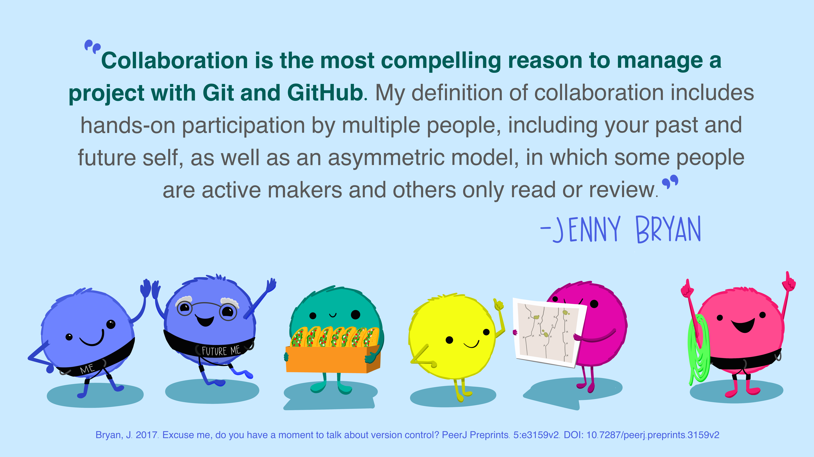

# Openscapes GitHub Clinic

This is the repository for Openscapes GitHub Clinics that are offered outside our Champions Program. 

GitHub is a powerful tool for collaborative coding with version control, but here we focus on some of its lesser-celebrated awesomeness. No prior knowledge needed to participate! We’ll practice GitHub hands-on for collaborative research and communication for science through publication and project management, all from the browser, with time together to get hands-on experience and experiment. We’ve designed this Clinic to share new skills for many experience levels. If these skills are already familiar to you, notice how we teach and facilitate so you can support your colleagues. 

Open source lesson materials: [GitHub strategies for publication and project management](https://openscapes.github.io/series/core-lessons/github/).

## Why GitHub?

Illustration from "GitHub for supporting, reusing, contributing, and failing safely", by [Lowndes & Horst, 2022](https://openscapes.org/blog/2022-05-27-github-illustrated-series/). Quote from "Excuse me, do you have a moment to talk about version control?", by [Bryan 2017](https://doi.org/10.7287/peerj.preprints.3159v2).

## More about Openscapes

- [**Our path to better science in less time using open data science
  tools**](https://www.nature.com/articles/s41559-017-0160) (Lowndes et
  al. 2017) - This describes a marine science team’s transition to open
  collaborative teamwork. It was the original inspiration for creating
  the Champions Program and heavily influences the Core Lessons. We’ll
  ask that everyone participating reads it before our first Cohort Call.
- [**Supercharge your research: a ten-week plan for open data
  science**](https://openscapes.github.io/supercharge-research/)
  (Lowndes et al. 2019) - This was co-authored with the inaugural
  Champions Cohort, capturing the most valuable take-aways for marine
  and environmental science early career faculty.
- [**Shifting institutional culture to develop climate solutions with
  Open
  Science**](https://onlinelibrary.wiley.com/doi/10.1002/ece3.11341)
  (Lowndes et al. 2024) - This was co-authored by Openscapes mentors
  across organizations – including NASA Earthdata, NOAA Fisheries, EPA,
  California Water Boards, Pathways to Open Science, Fred Hutch Cancer
  Center.
